# BunnyMall-project

"Bunny Mall", an e-commerce web application using Vue3, focused on creating a responsive and scalable online shopping platform while leveraging the latest frontend technologies to address key business requirements.

## Recommended IDE Setup

[VSCode](https://code.visualstudio.com/) + [Volar](https://marketplace.visualstudio.com/items?itemName=Vue.volar) (and disable Vetur).

## Customize configuration

See [Vite Configuration Reference](https://vite.dev/config/).

## Project Setup

```sh
npm install
```

### Compile and Hot-Reload for Development

```sh
npm run dev
```

### Compile and Minify for Production

```sh
npm run build
```

### Lint with [ESLint](https://eslint.org/)

```sh
npm run lint
```

# Introduction with features

### 1. Layout pages
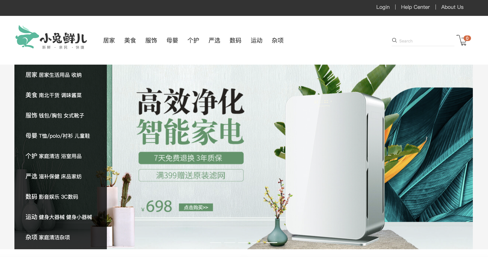
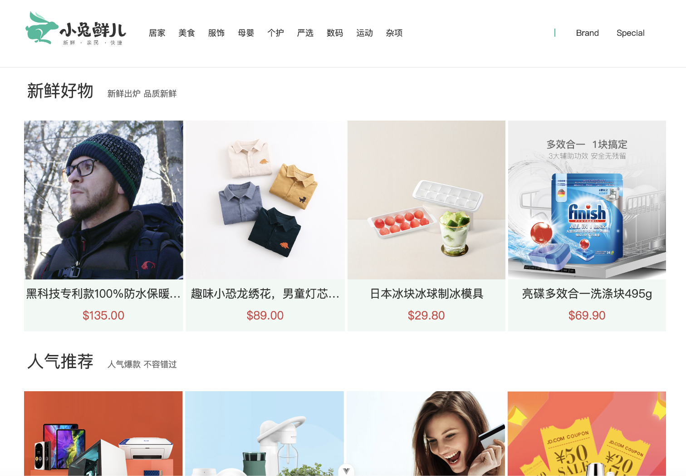
##### Sticky header
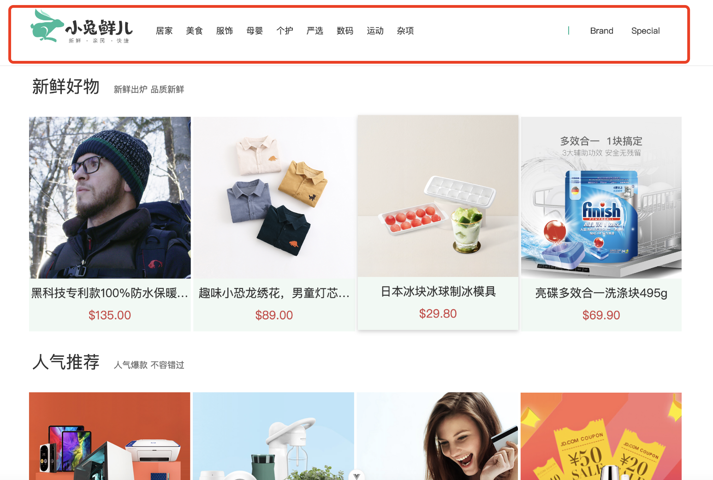
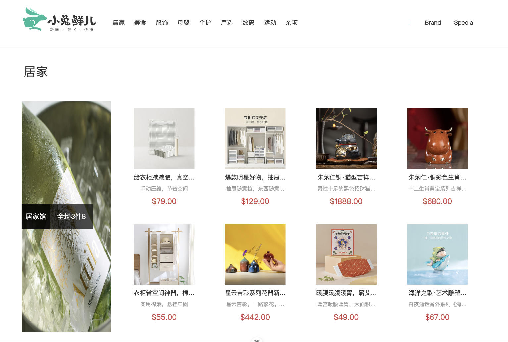
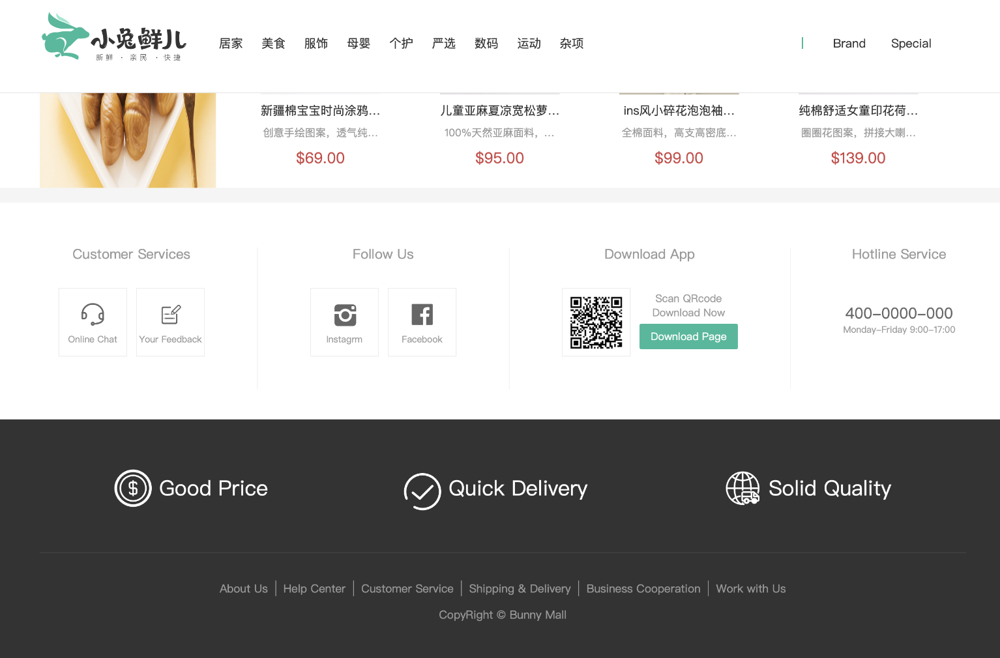


### 2. Login page
##### login with username and password authentication
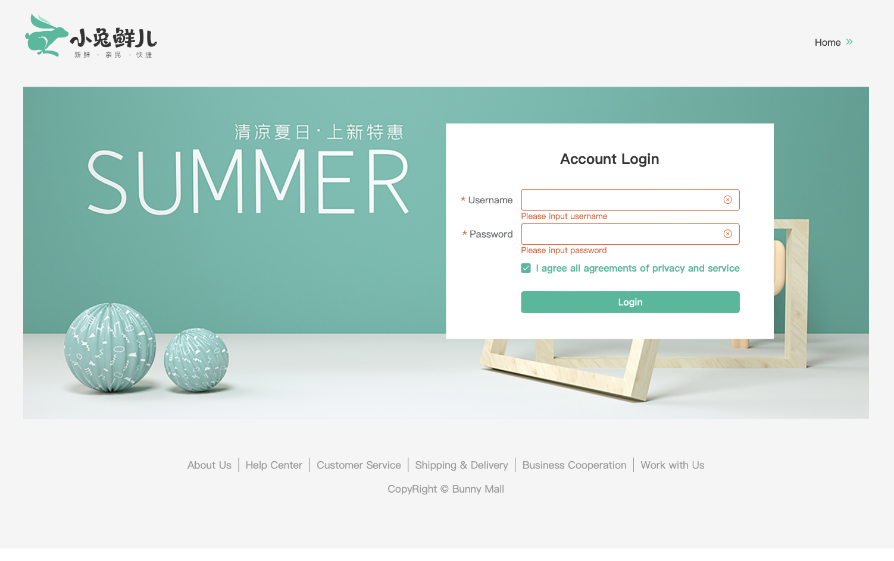

##### Navbar changes after login
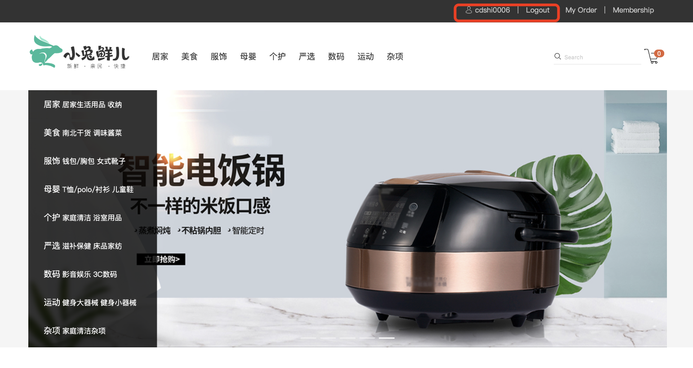

##### Pop confirm to log out
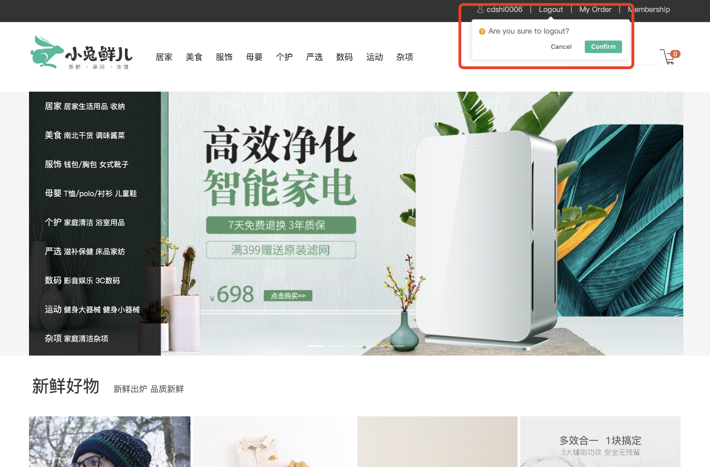

### 3. Categories pages
##### Enter the second categories
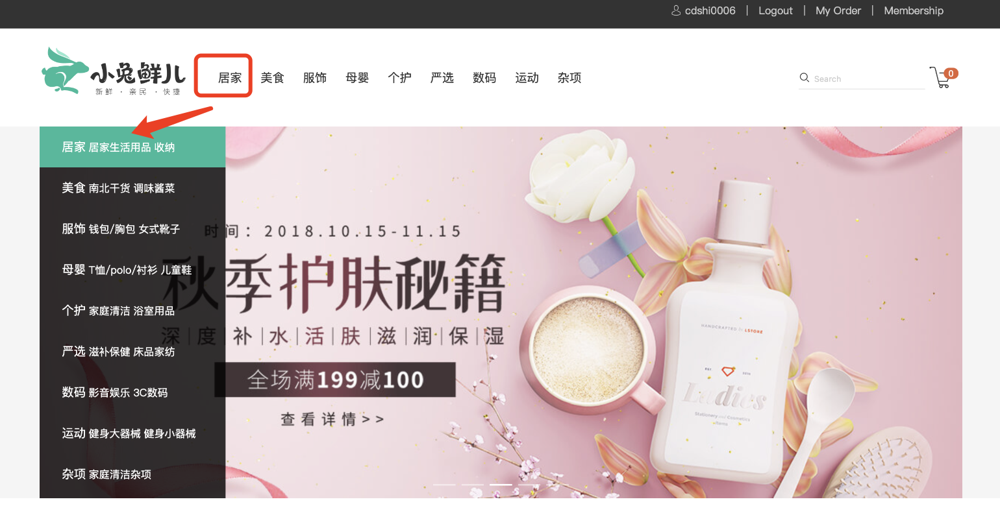
##### Show second categories details
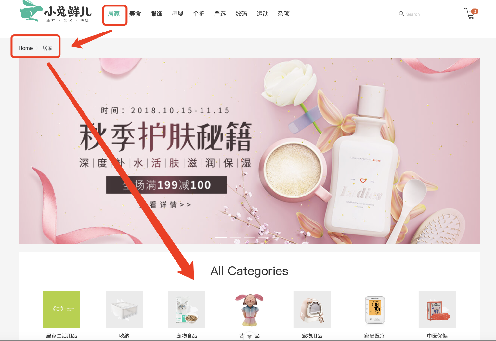
##### Show other categories
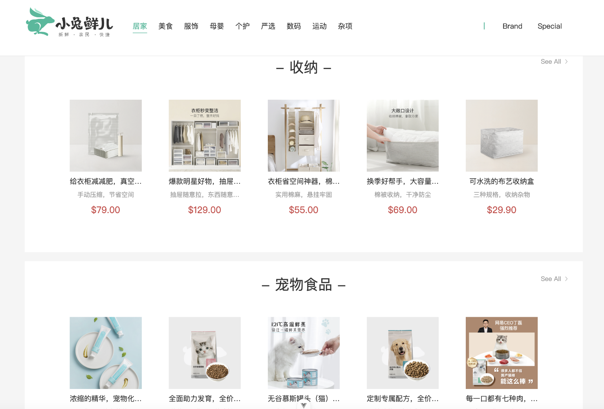
##### Enter the third categories page with different products ranks
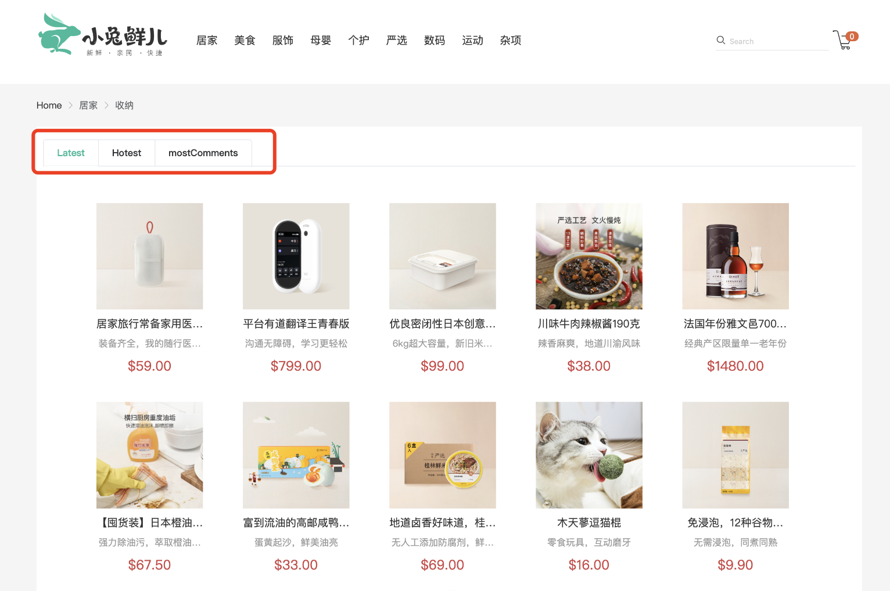
